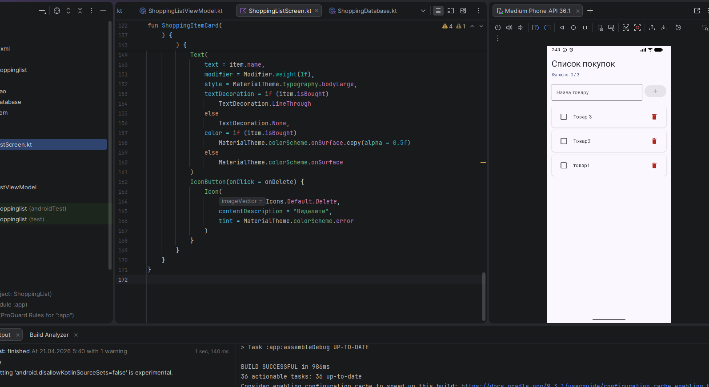

# Мобільний додаток "Список покупок" (Shopping List)

Проєкт Android-додатку для зручного ведення списку покупок. Розроблений з використанням сучасного стеку технологій: Kotlin, Jetpack Compose та бази даних Room.

**Розробник:** Деревʼянко Петро Павлович, студент групи ФІТ 1-3Мз.

---

## 🛠 Реалізовані можливості

- **Перегляд списку:** Зручна прокрутка товарів за допомогою `LazyColumn`.
- **Управління товарами:** Швидке додавання нових позицій через `TextField` та кнопку.
- **Статус покупок:** Можливість відмітити товар як куплений (працює як по кліку на чекбокс, так і на саму картку).
- **Візуальний зворотний зв'язок:** Автоматичне закреслення назви для вже куплених товарів.
- **Видалення:** Кнопка з іконкою кошика (🗑) для швидкого очищення списку.
- **Статистика:** Динамічний лічильник "Куплено: X / Y" у верхній частині екрану.
- **Постійне зберігання:** Всі дані та їхні статуси надійно зберігаються в локальній базі `Room` (SQLite) і відновлюються при наступному запуску.

## ⚙️ Стек технологій

- **Мова:** Kotlin
- **UI:** Jetpack Compose (декларативний підхід)
- **База даних:** Room 2.7.1
- **Архітектура:** MVVM (з використанням `AndroidViewModel` та `StateFlow`)
- **Інструментарій:** KSP (для генерації коду Room)

---

## 🌟 Власні покращення (Додатковий функціонал)

1. **Видалення товарів:** Інтегровано кнопку видалення безпосередньо в інтерфейс кожної картки товару.
2. **Прогрес-лічильник:** Додано інформативний рядок "Куплено: X з Y", який оновлюється в реальному часі залежно від відмічених чекбоксів.
3. **Плавні анімації:** Реалізовано появу нових товарів з використанням комбінації анімацій `fadeIn()` та `slideInVertically()`.
4. **Свайп для видалення (Swipe-to-dismiss):** Додано нативний жест свайпу вліво по картці товару. Під час свайпу з'являється червоний фон з іконкою кошика, після чого товар видаляється з бази.

---

## 🚧 Вирішення технічних проблем під час розробки

Під час виконання проєкту виникли певні складнощі, які були успішно вирішені:

| Опис проблеми | Спосіб вирішення |
| :--- | :--- |
| Застарілий плагін `kotlin-kapt`, який конфліктував з новою версією Android Studio. | Виконано міграцію на сучасний інструмент KSP (`com.google.devtools.ksp`). |
| Помилка `unexpected jvm signature V` при використанні Room 2.6.1 разом з KSP. | Версію бібліотеки Room було оновлено до стабільної 2.7.1. |
| Відсутність доступу до розширеного набору іконок (`Icons.Default.*`). | В `build.gradle` додано залежність `compose.material:material-icons-extended`. |
| Проблеми KSP з генерацією source sets у нових версіях Gradle. | Додано конфігураційний прапорець `android.disallowKotlinSourceSets=false` до файлу `gradle.properties`. |

---

## 💡 Примітка щодо Retrofit

Згідно з матеріалами лекції (що було підтверджено лектором у секції Q&A), до реалізації мережевої взаємодії через Retrofit ми не дійшли. Тому цей репозиторій містить 100% того функціоналу, який фактично розбирався та був показаний на занятті, разом із додатковими покращеннями інтерфейсу.
